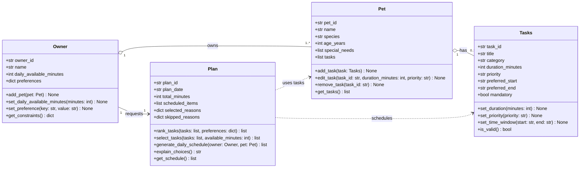

```mermaid
classDiagram
direction LR

class Owner {
	+str owner_id
	+str name
	+int daily_available_minutes
	+dict preferences
	+add_pet(pet: Pet) None
	+set_daily_available_minutes(minutes: int) None
	+set_preference(key: str, value: str) None
	+get_constraints() dict
}

class Pet {
	+str pet_id
	+str name
	+str species
	+int age_years
	+list special_needs
	+list tasks
	+add_task(task: Tasks) None
	+edit_task(task_id: str, duration_minutes: int, priority: str) None
	+remove_task(task_id: str) None
	+get_tasks() list
}

class Tasks {
	+str task_id
	+str title
	+str category
	+int duration_minutes
	+str priority
	+str preferred_start
	+str preferred_end
	+bool mandatory
	+set_duration(minutes: int) None
	+set_priority(priority: str) None
	+set_time_window(start: str, end: str) None
	+is_valid() bool
}

class Plan {
	+str plan_id
	+str plan_date
	+int total_minutes
	+list scheduled_items
	+dict selected_reasons
	+dict skipped_reasons
	+rank_tasks(tasks: list, preferences: dict) list
	+select_tasks(tasks: list, available_minutes: int) list
	+generate_daily_schedule(owner: Owner, pet: Pet) list
	+explain_choices() str
	+get_schedule() list
}

Owner "1" o-- "1..*" Pet : owns
Pet "1" o-- "0..*" Tasks : has
Owner "1" --> "1" Plan : requests
Plan ..> Pet : uses tasks
Plan ..> Tasks : schedules
```
