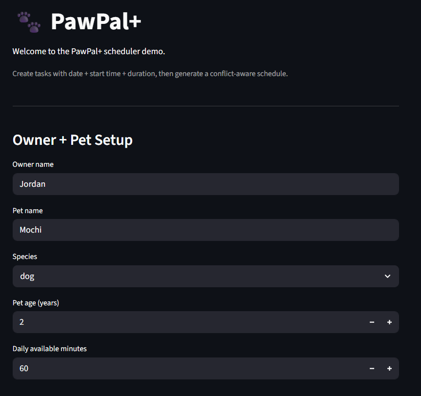
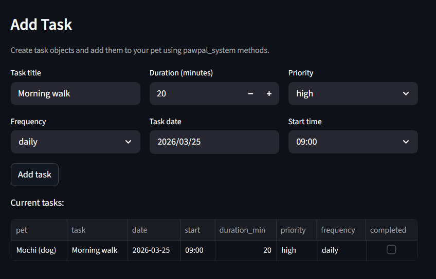
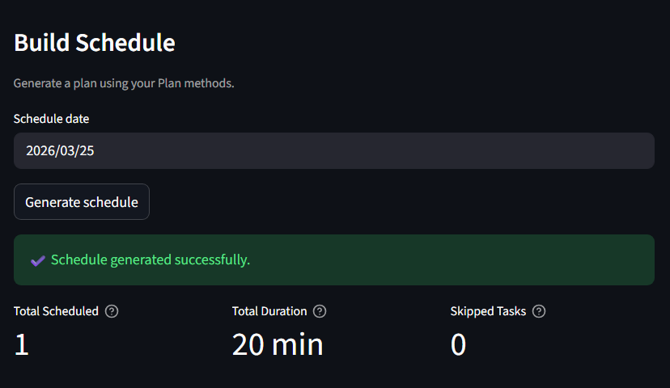
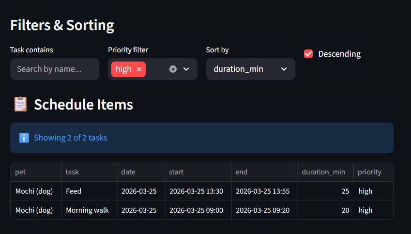
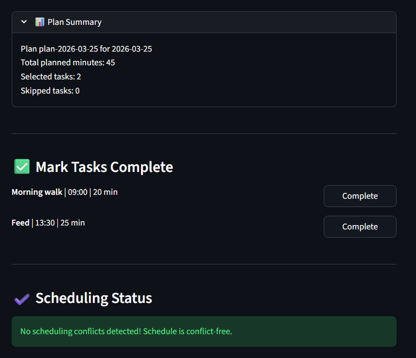

# PawPal+ (Module 2 Project)

A smart Streamlit app that helps busy pet owners plan and manage pet care tasks efficiently.

## What is PawPal+?

**PawPal+** is an intelligent pet care scheduling assistant that helps owners stay consistent with their pet care routines. The app intelligently prioritizes tasks, respects time constraints, and generates conflict-aware daily schedules while explaining its reasoning.

### Core Features

- **Task Management**: Create and organize pet care tasks (walks, feeding, meds, enrichment, grooming, etc.)
- **Smart Scheduling**: Generate daily plans based on priorities, duration, and owner availability
- **Time Sorting**: Organize tasks by duration (shortest first or longest first)
- **Conflict Detection**: Identify and warn about overlapping task time windows
- **Task Filtering**: Filter tasks by completion status or pet name
- **Recurring Tasks**: Automatically rollover daily and weekly tasks to the next occurrence
- **Priority Levels**: Support for critical, high, medium, and low priority tasks
- **Schedule Explanation**: Understand why certain tasks were included or skipped
- **Multi-Pet Support**: Manage care for multiple pets under one owner profile
- **Interactive UI**: User-friendly Streamlit interface with real-time schedule generation

## Scenario

A busy pet owner needs help staying consistent with pet care. They want an assistant that can:

- Track pet care tasks (walks, feeding, meds, enrichment, grooming, etc.)
- Consider constraints (time available, priority, owner preferences)
- Produce a daily plan and explain why it chose that plan

## What You Built

Your app enables users to:

- Enter owner and pet information
- Add and edit tasks with duration and priority
- Generate daily schedules based on constraints and priorities
- View schedules clearly with detailed explanations
- Monitor scheduling conflicts and task completion

## Advanced Scheduling Features

### 1. Intelligent Time Sorting

Tasks can be ordered by duration using owner preference `time_sort`:

- `shortest_first` (default) — Schedule shorter tasks first
- `longest_first` — Schedule longer tasks first (also accepts `desc` or `descending`)

This flexibility allows different owners to match their preferred scheduling strategy.

### 2. Task Filtering & Search

Easily find and manage specific tasks:

- Filter by completion status (`completed=True` or `False`) — See only pending or finished tasks
- Filter by pet name (case-insensitive) — Focus on one pet's schedule
- Combine filters for focused views such as "all unfinished tasks for Luna"

### 3. Recurring Task Automation

When a recurring task is marked complete, a new instance automatically rolls over:

- **Daily tasks** create a new instance for the next day
- **Weekly tasks** create a new instance for the next week
- **One-time and monthly tasks** do not recur
- Due dates are calculated accurately using `timedelta`

### 4. Conflict Detection & Warnings

Scheduling no longer crashes on overlapping time windows:

- System records warnings when two scheduled tasks overlap in the same time slot
- Detects conflicts for the same pet and across different pets
- Warnings are available via `get_conflict_warnings()` and displayed in the UI
- Helps identify scheduling bottlenecks and double-booked time slots

### 5. Priority-Based Scheduling

Tasks are ranked and selected by priority:

- **Critical** — A1 priority, scheduled first
- **High** — Important but can be deferred if time-constrained
- **Medium** — Secondary tasks
- **Low** — Nice-to-have tasks
- When time budget is tight, lower-priority tasks are skipped first

### 6. Transparent Decision Logging

Every schedule includes detailed explanations:

- View why each task was included in the plan
- Understand why certain tasks were skipped
- See total scheduled time vs. available daily time
- Review task selection counts at a glance

### 7. Demo

[](images/image1.png)
[](images/image2.png)
[](images/image3.png)
[](images/image4.png)
[](images/image5.png)

## Testing

Current tests cover core scheduler behavior:

- **Sorting & Prioritization**: Validates priority-first scheduling with chronological ordering when valid time windows are provided
- **Recurring Tasks**: Confirms completing daily and weekly tasks creates the next occurrence with the correct due date
- **Conflict Detection**: Verifies overlapping and duplicate time windows are flagged as warnings
- **Filtering**: Checks completion-based filtering, pet-name filtering, and task completion state changes
- **State Management**: Ensures task selection occurs within available time budget

**Test Confidence Level**: ⭐⭐⭐⭐⭐ (5 stars)

Run tests with:

```bash
python -m pytest
```

## Getting Started

### Prerequisites

- Python 3.8+
- pip

### Setup

```bash
# Create a virtual environment
python -m venv .venv

# Activate the virtual environment
# On Windows:
.venv\Scripts\activate
# On macOS/Linux:
source .venv/bin/activate

# Install dependencies
pip install -r requirements.txt
```

### Run the App

```bash
streamlit run app.py
```

The app will open in your browser at `http://localhost:8501`

## Development Workflow

Recommended development process:

1. **Understand Requirements**: Read the scenario carefully; identify requirements and edge cases
2. **Design**: Draft a UML diagram showing classes, attributes, methods, and relationships
3. **Scaffold**: Convert UML into Python class stubs with method signatures (no logic yet)
4. **Implement**: Add scheduling logic in small, testable increments
5. **Test**: Write tests to verify key behaviors (scheduling, filtering, conflict detection)
6. **Integrate**: Connect logic to the Streamlit UI in `app.py`
7. **Refine**: Update UML to match the final implementation

## Project Structure

```
ai110-module2show-pawpal-starter/
├── app.py                 # Streamlit UI
├── pawpal_system.py       # Core scheduling logic (Owner, Pet, Task, Plan)
├── main.py               # CLI demo/testing script
├── tests/
│   └── test_pawpal.py    # Unit tests for scheduling behavior
├── Mermaid.md            # UML class diagram
├── README.md             # This file
├── requirements.txt      # Python dependencies
└── .venv/                # Virtual environment (after setup)
```

## Key Classes

- **Owner**: Represents a pet owner with time availability and preferences
- **Pet**: Represents a pet (dog, cat, etc.) with associated tasks
- **Task**: Represents a pet care task with duration, priority, and frequency
- **Plan**: Generates daily schedules respecting constraints and priorities
