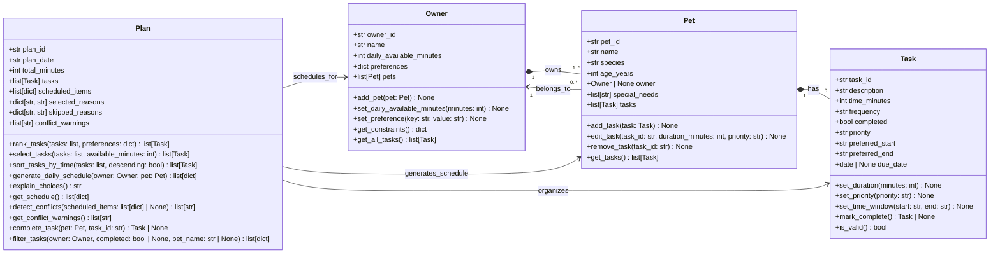

```mermaid
classDiagram
direction LR

class Owner {
	+str owner_id
	+str name
	+int daily_available_minutes
	+dict preferences
	+list[Pet] pets
	+add_pet(pet: Pet) None
	+set_daily_available_minutes(minutes: int) None
	+set_preference(key: str, value: str) None
	+get_constraints() dict
	+get_all_tasks() list[Task]
}

class Pet {
	+str pet_id
	+str name
	+str species
	+int age_years
	+Owner | None owner
	+list[str] special_needs
	+list[Task] tasks
	+add_task(task: Task) None
	+edit_task(task_id: str, duration_minutes: int, priority: str) None
	+remove_task(task_id: str) None
	+get_tasks() list[Task]
}

class Task {
	+str task_id
	+str description
	+int time_minutes
	+str frequency
	+bool completed
	+str priority
	+str preferred_start
	+str preferred_end
	+date | None due_date
	+set_duration(minutes: int) None
	+set_priority(priority: str) None
	+set_time_window(start: str, end: str) None
	+mark_complete() Task | None
	+is_valid() bool
}

class Plan {
	+str plan_id
	+str plan_date
	+int total_minutes
	+list[Task] tasks
	+list[dict] scheduled_items
	+dict[str, str] selected_reasons
	+dict[str, str] skipped_reasons
	+list[str] conflict_warnings
	+rank_tasks(tasks: list, preferences: dict) list[Task]
	+select_tasks(tasks: list, available_minutes: int) list[Task]
	+sort_tasks_by_time(tasks: list, descending: bool) list[Task]
	+generate_daily_schedule(owner: Owner, pet: Pet) list[dict]
	+explain_choices() str
	+get_schedule() list[dict]
	+detect_conflicts(scheduled_items: list[dict] | None) list[str]
	+get_conflict_warnings() list[str]
	+complete_task(pet: Pet, task_id: str) Task | None
	+filter_tasks(owner: Owner, completed: bool | None, pet_name: str | None) list[dict]
}

Owner "1" *-- "1..*" Pet : owns
Pet "0..*" --> "1" Owner : belongs_to
Pet "1" *-- "0..*" Task : has
Plan --> Owner : schedules_for
Plan --> Pet : generates_schedule
Plan --> Task : organizes
```
